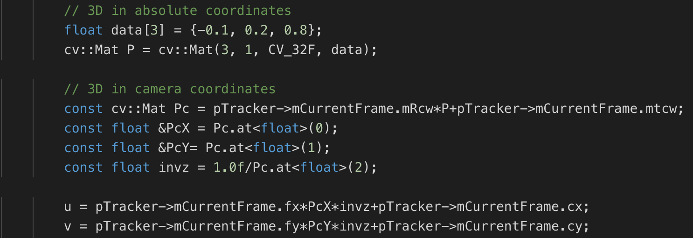
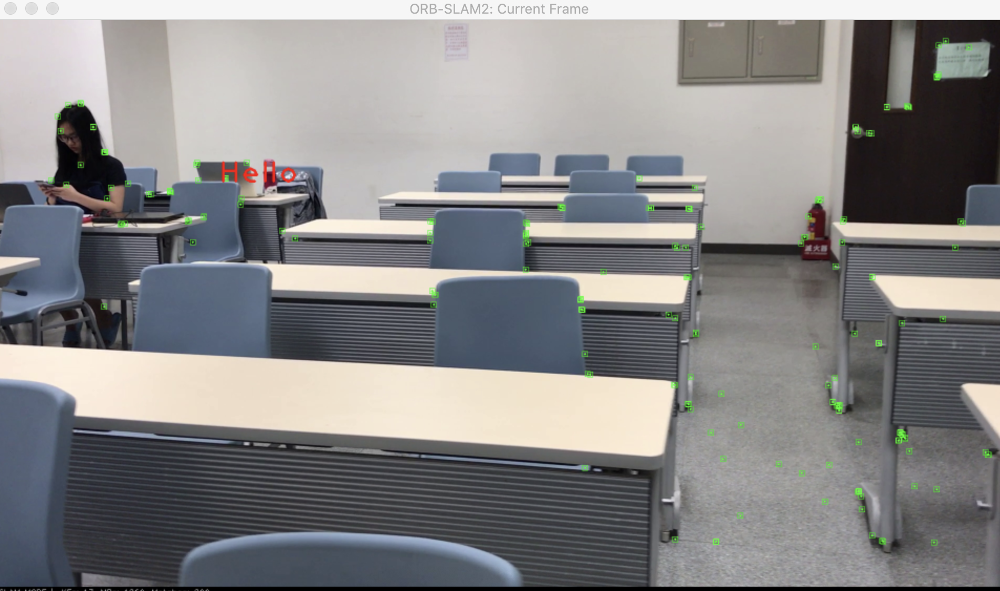
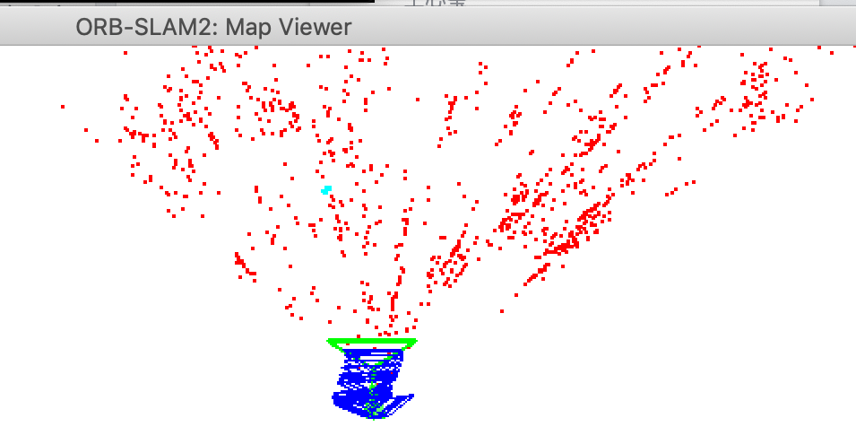
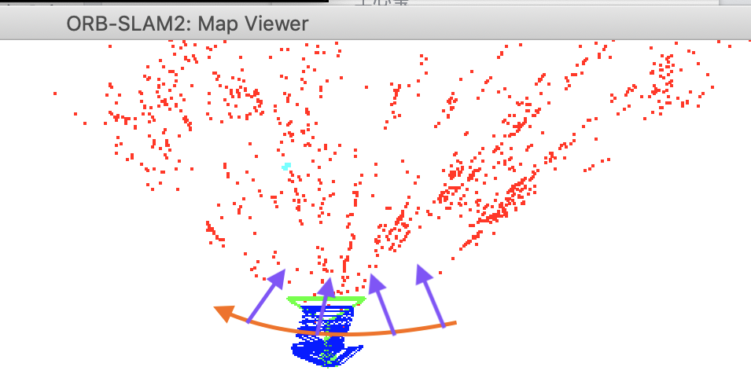

# CVFX-homework-6
Homework 6 for CVFX, team 7.

## Assign
1. 5% (Take videos by yourselves)
2. 10% (Make these visual effects with ORB-SLAM2)
3. 10% (Make these visual effects with any post-production software)
4. 10% (Compare above methods)
5. 10% (Make some special effects based on the pose information, such as rotating, zooming in or out)
6. 5% (Insert a 3D model to your video)
7. 10% (Bonus- Make visual effects with other SLAM methods.)

## Take videos by yourselves

The video is <a href="https://drive.google.com/file/d/1hVUXxp7q34hKQpOnVNforME0AhKJYDIE/view?usp=sharing">here</a>. 

## Make these visual effects with ORB-SLAM2

### Results

The video is <a href="https://youtu.be/TwPsq0ncPQc">here</a>. 

This is <a hred="https://youtu.be/tzAapfS7m94" >color version</a>

### 作法
ORB SLAM中利用相機視角與key points深度建構了一個3D的世界，frame.h中的cv::Mat mRcw、cv::Mat mtcw就是將3D世界坐標系轉2D相機畫面再轉到圖片座標需要的矩陣。

所以我們做的事就是固定一個3D世界座標，然後用公式轉到圖片座標。作法如下圖。

P是固定的世界座標[-0.1, 0.2, 0.8]，並沒有特殊意義，只是從map points的座標中發現這附近數值的點是可以在相機中出現較常時間的。

為了確認該點在3D世界中的位置，在pangolin的frame也把點畫上去並跟目前圖片畫面比較：  
右圖中青色的點就是目前"Hello"字樣所在的空間位置。可以看到兩者是差不多的。

|2D Picture Frame|3D World Frame|
|:--:|:--:|
|||

此外，因為在做處理時，ORB SLAM會將圖轉成灰階，我們希望在顯示時能是彩色，所以在Tracking.cc裡面做了一些調整，保留原本的彩色frame給FrameDrawer畫。

### 小結
我們使用的是KITTI dataset設定的.yaml檔，但從相機軌跡上來看，其實他是有一些不準確的，我們實際上的移動情況應該如下圖：  
橘色箭頭是相機移動的軌跡，紫色箭頭是相機視角方向。

所以在結果的影片中，字所在位置其實沒有非常準。如果希望相機軌跡能跟實際更相近、更準確的話，可能要自己做camera calibration，因為比較花時間所以這部分我們並沒有做。

## Make these visual effects with any post-production software

## Compare above methods

仔細觀察利用ORB SLAM做出的影片，我們可以發現字會有類似手抖到，上下晃動的現象，例如在影片的10秒處。推測是導因於程式所用的相機參數和實際的參數有誤差的緣故。

至於用AE後製出來的影片，字的水平位置就很穩定，沒有抖到的感覺。

兩個做法都沒有加上影子，在對字的不同深度假設下都會有不一樣的感覺。例如在ORB SLAM的影片中，如果假設字和桌上的水壺是同深度的話，會感覺我們觀察到字有往右移動的現象：原本Hello的H完整的壓在桌上的水壺前，隨著影片的進行，漸漸朝右遠離水壺。但如果假設字跟前一排的桌子同深度的話，則會反而覺得字有些微往左飄。用AE後製出的影片也是一樣：如果假設字和桌上的筆電同深度的話，會覺得字有往左移動的傾向。在影片的一開始Hello的H並沒有和到桌上的筆電有重疊，隨著影片的進行漸漸往左方的筆電靠近，最後有半個H壓在筆電前。雖然事實上很難說服大腦把字的位置想的跟後面的牆壁同深度，因為字都擋住了深度較淺的電腦，但如果這麼假設的話，Hello的o跟牆上的插座的相對關係會讓人則會覺得字往右飄。

綜上所述，兩個方法做出的結果大致上差不多，就是ORB SLAM的結果會稍稍受相機參數的誤差影響。而在沒有影子這個幫助判斷深度的提示下，人會因為視差，覺得前面的物體該動的必較多的想法，對同一部影片會有不同感覺。

## Make some special effects based on the pose information, such as rotating, zooming in or out

## Insert a 3D model to your video
